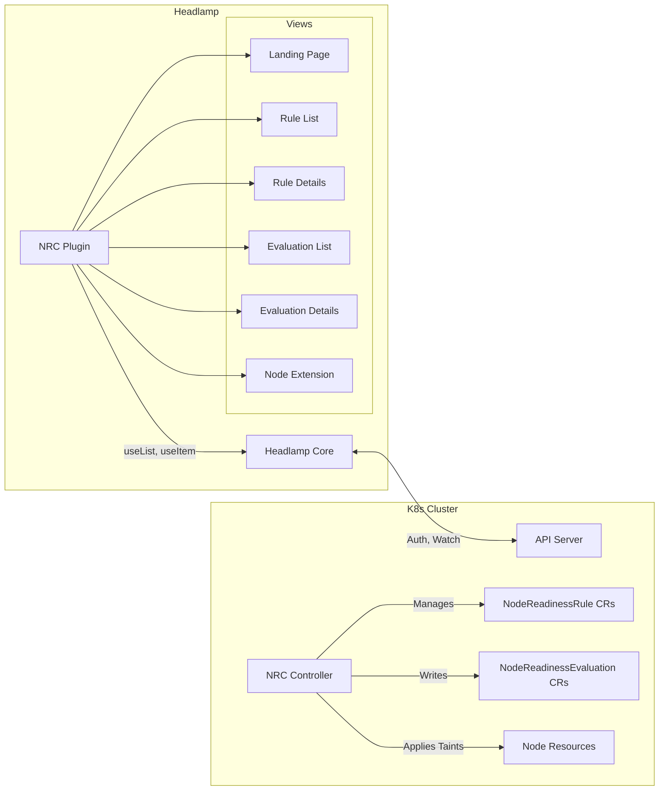

# UI Design Document: Node Readiness Controller

### LFX Project: Headlamp Plugin for Node Readiness Controller (Term 3)

This project brings native UI visibility to the Node Readiness Controller (NRC) via a [Headlamp](https://headlamp.dev/) plugin. This is a continuation of the Term 2 observability project, which delivered the metrics foundation, scrape-time collectors, and Grafana dashboard.

The project answers two main questions:

1. **Per-object readiness state:** Why is this specific node not accepting workloads? Which rule, condition, or taint is holding it back? Today this requires `kubectl describe node`, controller logs, or raw YAML parsing.
2. **Fleet-wide rule enforcement:** Across all rules, how many nodes are matched, held, or released? Which rules are failing and where? Today this is answered only through Prometheus queries and the Grafana dashboard built in Term 2.

### Goals

* Build a Headlamp plugin to visualize cluster-wide rule enforcement and per-node readiness state.
* Provide cluster-level views: all `NodeReadinessRule` objects with nodes matched / held / bootstrap-completed per rule.
* Provide node-level detail views: which rules apply to a node, per-condition status with failure reasons, NRC-managed taints, related Events (`TaintAdded`/`TaintRemoved`/`TaintAdopted`/`BootstrapCompleted`).
* Build a unified lifecycle-conditions panel showing NRC custom conditions alongside standard kubelet conditions.
* Serve as the first consumer ("soaking test") of the upcoming `NodeReadinessEvaluation` CRD, reporting bugs and design gaps back to the NRC controller team.
* Minimize Kubernetes API overhead. Watch-based, API-state only.
* Validate and document UX and scale tests / limits for the plugin.
* Publish to Headlamp Artifact Hub with documentation.

### Non-Goals

* Build a standalone backend API or web server. The plugin runs entirely inside Headlamp.
* Replace the Prometheus metrics and Grafana dashboard from Term 2. Headlamp gives visibility into per-object questions; Grafana answers fleet-wide SLO questions over time.
* Implement custom WebSocket or polling mechanisms. We rely on Headlamp's built-in watch hooks.

### Relationship to Term 2 Observability

The Term 2 observability project delivered Prometheus metrics (`node_readiness_rule_nodes{state}`, `node_readiness_rule_matched_nodes`, etc.) via scrape-time collectors and a Grafana dashboard for fleet-wide SLO monitoring. This plugin complements that work by answering **per-object** questions that metrics cannot: _which_ node is failing _which_ rule's _which_ condition, and what the failure reason is. The two systems serve different personas — Grafana for SREs monitoring trends over time, Headlamp for operators debugging a specific node right now. The backend data that powers both is the same (the controller's informer cache and CRD status fields), and the proposed `status.summary` field would bring the same aggregated counts that Prometheus already exposes into the CRD status for direct UI consumption without requiring a Prometheus dependency.

## Design

### 1. Personas

We design the UI around the same distinct personas used in the controller observability design.

1. **Infrastructure Owners (Cluster Operators):** They run the cluster and manage the node lifecycle. They need a Landing Page to confirm the controller is active and see fleet-wide enforcement status without leaving the dashboard.
2. **Component / Rule Owners:** They own the infrastructure components that gate node readiness (CNI, GPU drivers, CSI). They need the Rule Details View to see how their rule propagates and which nodes are failing.
3. **Workload Owners (Application Developers):** They run pods. They need the Node Detail Extension to understand why their pods are not scheduling on a specific node.

---

### 2. Code Organization

The project spans two repositories. All plugin UI code (React components, styles, tests) lives in the Headlamp plugins repository. Design documentation and any backend API changes live in the NRC repository.

| Repository | Contents |
|---|---|
| `headlamp-k8s/plugins` | Plugin source (`src/`), `package.json`, unit tests, `CODEOWNERS`, Artifact Hub metadata. Reviewed by Headlamp maintainers. |
| `kubernetes-sigs/node-readiness-controller` | This design document (`docs/`), backend changes (e.g., `status.summary` on `NodeReadinessRule`). Reviewed by NRC maintainers. |

All PRs are cross-referenced against [Issue #327](https://github.com/kubernetes-sigs/node-readiness-controller/issues/327) for traceability.

---

### 3. CRD Data Surface

The plugin reads from the `readiness.node.x-k8s.io/v1alpha1` API group. Both custom resources are cluster-scoped.

#### NodeReadinessRule fields consumed

| JSON path | Type | Used in |
|---|---|---|
| `metadata.name` | `string` | Rule List, Rule Details |
| `metadata.creationTimestamp` | `Time` | Rule List (Age), Rule Details |
| `metadata.deletionTimestamp` | `Time` | Rule List (Terminating status) |
| `spec.enforcementMode` | `bootstrap-only` or `continuous` | Rule List (chip), Rule Details |
| `spec.dryRun` | `bool` | Rule List (amber chip), Rule Details |
| `spec.nodeSelector.matchLabels` | `map[string]string` | Rule List (count + tooltip), Rule Details |
| `spec.nodeSelector.matchExpressions` | `[]LabelSelectorRequirement` | Rule Details |
| `spec.conditionPolicy` | `allOf` or `anyOf` | Rule List (chip), Rule Details |
| `spec.taint.key` | `string` | Rule List, Rule Details |
| `spec.taint.effect` | `NoSchedule` / `PreferNoSchedule` / `NoExecute` | Rule List (chip), Rule Details |
| `spec.conditions[].type` | `string` | Rule Details (conditions table) |
| `spec.conditions[].requiredStatus` | `True` / `False` / `Unknown` | Rule Details (conditions table) |
| `spec.conditions[].defaultStatus` | `True` / `False` / `Unknown` | Rule Details (conditions table) |
| `status.appliedNodes` | `[]string` (max 5000) | Rule Details (satisfied count) |
| `status.failedNodes[].nodeName` | `string` | Rule Details (failed count) |
| `status.failedNodes[].reason` | `string` | Rule Details (failure reason) |
| `status.failedNodes[].message` | `string` | Rule Details (failure message) |
| `status.nodeEvaluations[].nodeName` | `string` | Rule Details (per-node audit) |
| `status.nodeEvaluations[].taintStatus` | `Present` / `Absent` | Rule Details |
| `status.nodeEvaluations[].conditionResults[]` | `[]ConditionEvaluationResult` | Rule Details |
| `status.dryRunResults.affectedNodes` | `*int32` | Rule Details (dry-run preview) |
| `status.dryRunResults.taintsToAdd` | `*int32` | Rule Details (dry-run preview) |
| `status.dryRunResults.taintsToRemove` | `*int32` | Rule Details (dry-run preview) |
| `status.dryRunResults.riskyOperations` | `*int32` | Rule Details (dry-run preview) |
| `status.dryRunResults.summary` | `string` | Rule Details (dry-run preview) |

Note: `status.nodeEvaluations` is planned for deprecation. The UI will migrate to a `status.summary` field with pre-computed aggregated counts once available upstream. Until then, the UI reads `status.appliedNodes.length` and `status.failedNodes.length` for counts.

#### NodeReadinessEvaluation fields consumed

The `NodeReadinessEvaluation` (NRE) CRD is a per-node evaluation object currently under development ([PR in review](https://github.com/kubernetes-sigs/node-readiness-controller/issues/327)). It is targeted to ship as **experimental in NRC v0.6.0** and stabilize in **v0.7.0**. The existing `node_controller.go` is being extended to produce NRE updates (no separate controller).

The Headlamp plugin will serve as the first consumer of NRE, acting as a soaking test to validate the API design and uncover bugs before NRE graduates to stable. The NRE views (Sections 6.4 and 6.5) will be implemented once NRE merges.

#### Node fields consumed (for Node Extension)

| JSON path | Used for |
|---|---|
| `spec.taints[]` | Filtering taints with `readiness.k8s.io/` prefix |
| `status.conditions[]` | Grouping NRC custom conditions vs standard kubelet conditions |
| `spec.unschedulable` | Cross-referencing with NRC taint state |

---

### 4. Integration Architecture

The plugin is a standard Headlamp extension built with React and TypeScript (`@kinvolk/headlamp-plugin`). It uses Headlamp's built-in Kubernetes API client for authentication and RBAC. No standalone backend.

---

### 5. State Synchronization (DOM Modeling)

The UI must stay in sync with cluster state. When an operator modifies, creates, or deletes a rule via `kubectl`, the UI must update without page reloads.

**Decision:** No custom polling or WebSockets. The plugin relies on Headlamp's `KubeObject.useList()` and `KubeObject.useItem()` hooks exclusively. These hooks use the Kubernetes Watch API under the hood and trigger React re-renders on standard watch events:

* **`ADDED`:** New row appears in the list view automatically.
* **`MODIFIED`:** Changed fields (status counts, spec edits) re-render in place.
* **`DELETED`:** Item is removed from list. If viewing the Details page of a deleted resource, the hook returns a `404` and the UI renders a "Resource not found" fallback.

No manual DOM manipulation is needed. React's reconciliation handles all UI updates from the hook state changes.

---

### 6. Data Fetching Strategy

Fetching every node evaluation to count satisfied/failed nodes on the frontend causes API overhead on large clusters. The `status.appliedNodes`, `status.failedNodes`, and `status.nodeEvaluations` fields are each capped at 5000 items.

#### Decisions

| Decision | Rationale |
|---|---|
| **Lazy initial load.** The Landing Page verifies CRD existence only. It does not list rules or evaluations. | Prevents API blast on plugin open. |
| **Backend aggregation.** Node counts (matched, held, released) will be read from a `status.summary` field on `NodeReadinessRule` once available upstream. | Avoids client-side pagination through thousands of node evaluations. The Term 2 scrape-time collector already computes `node_readiness_rule_nodes{state}` and `node_readiness_rule_matched_nodes` from the informer cache. A `status.summary` field on the CRD provides the same data without Prometheus. |
| **Interim client-side counting.** Until `status.summary` is available, the UI reads `status.appliedNodes.length` and `status.failedNodes.length`. | Provides usable data immediately. |
| **Cardinality-aware filtering.** Columns like Name, Node Selector, and Taint are filterable but high-cardinality. Filters will use exact-match or substring search, not dropdown enums. Low-cardinality columns (Mode, Effect, Dry-Run) use dropdown filters. | Prevents loading thousands of unique filter values into memory. |

---

### 7. UI Surface

We define six primary user interfaces plus supporting features.

#### 7.1 Landing Page

The entry point for the plugin. Does not fetch heavy data.

* **CRD Detection:** Checks for `NodeReadinessRule` CRD existence. If not installed, shows "Node Readiness Controller not detected" with a link to installation instructions.
* **Controller Status:** Badge showing "Installed & Active" or "Not Found".
* **Infographics:** High-level summary cards showing total active rules, total nodes under evaluation, and global satisfied/held ratio. These are derived from a single `NodeReadinessRule` list call (not per-node queries).

#### 7.2 Rule List View

Table of all `NodeReadinessRule` objects.

| Column | Source | Filterable | Notes |
|---|---|---|---|
| Name | `metadata.name` | Yes (substring, cardinality concern) | Links to Rule Details |
| Mode | `spec.enforcementMode` | Yes (dropdown) | Chip/badge |
| Dry-Run | `spec.dryRun` | Yes (true/false dropdown) | Amber chip "Dry Run" if true, subtle "-" if false |
| Status | Computed from `status` | Yes (all satisfied / not all satisfied) | `✅ {satisfied} / {targeted} nodes satisfied` or `⚠️`. Show `⚠️ Terminating` if `metadata.deletionTimestamp` is present |
| Failed Nodes | `status.failedNodes.length` | Yes (has failure / no failure) | Show count if > 0, else "-". Optional column |
| Missing Conditions | Computed | Yes (has missing / no missing) | Count of nodes where a required condition is absent. Optional column |
| Node Selector | `spec.nodeSelector.matchLabels` | Yes (substring, cardinality concern) | Optional column |
| Taint | `spec.taint.key` | Yes (substring, cardinality concern) | |
| Effect | `spec.taint.effect` | Yes (dropdown) | Chip/badge |
| Condition Policy | `spec.conditionPolicy` | Yes (dropdown) | Chip/badge. Optional column |
| Age | `metadata.creationTimestamp` | No | |

#### 7.3 Rule Details View

Deep dive into a single `NodeReadinessRule`.

**Basic Info:**
* Name, creation timestamp, labels (chip/badge, provided by Headlamp default).
* Node Selector — rendered like Deployment selectors.
* Enforcement Mode — chip/badge.
* Dry-Run — 🟡 Yes / No.
* Condition Policy.
* Taint Managed — formatted as `taint.key:taint.effect`.
* Node Status — chips in a row (like Deployment replicas): Total targeted: `{count}`, Satisfied: `{count}`, Unsatisfied: `{count}`, Evaluation Failed: `{count}`. (Requires `status.summary` upstream update, interim uses `status.appliedNodes.length` / `status.failedNodes.length`.)

**Conditions Table:**

| Column | Source |
|---|---|
| Type | `spec.conditions[].type` |
| Required Status | `spec.conditions[].requiredStatus` |
| Default Status | `spec.conditions[].defaultStatus` |

**Events:**
Standard Headlamp events section. Will be updated if any modification is needed.

#### 7.4 Node Readiness Evaluation List View

Table of all `NodeReadinessEvaluation` objects. Blocked on NRE CRD merging (expected experimental in NRC v0.6.0).

| Column | Source | Filterable | Notes |
|---|---|---|---|
| Name | `metadata.name` | Yes (substring) | Links to NRE Details. Next line: "View Node" text CTA linking to Headlamp native Node page |
| State | `status.state` | Yes (dropdown) | Green badge "Available", Headlamp native color badge "Not Available" |
| Rules Status | Computed from `status.rules[]` | Yes (all satisfied / not all satisfied) | `✅ {satisfied} / {total}` or `⚠️ {satisfied} / {total}` |
| Age | `metadata.creationTimestamp` | No | |

If the CRD is not installed, show appropriate message with redirect to installation instructions.

#### 7.5 Node Readiness Evaluation Details View

Deep dive into a single node's evaluation. Blocked on NRE CRD merging.

**Basic Info:**
* Name, creation timestamp, Headlamp defaults.
* Target Node — "Visit Node" CTA linking to native Headlamp Node page.
* State — green badge "Available", Headlamp native color badge "Not Available".
* Active Taints — "None" plain text, or Headlamp native badge for all NRR-specific taints active on the node.
* Rule Status — total: `{count}`, satisfied: `{count}`, unsatisfied: `{count}`, failed: `{count}`.

**Conditions Section:**
Standard Headlamp conditions section, matching the Node Details page layout.

**Rule Evaluations Section:**
Expandable table. Each row in collapsed form:

| Column | Notes |
|---|---|
| Rule Name | "Visit Rule" CTA in next line |
| Enforcement Mode | |
| Status | Green/red Headlamp badge |
| Taint | Badge if present, else "-" |
| Conditions | `✅ {satisfied} / {total}` or `⚠️ {satisfied} / {total}`. Append `[anyOf]` if `conditionPolicy` is `anyOf`. Hide policy label if `allOf`. |

On expanding a row:

**Rule Evaluation Basic Info:**
* Reason
* Message
* Last Evaluation At
* `⏱️ Unblock Duration: 42s` or `⏳ Currently Blocked: 3m 12s`
* First Evaluation At
* Taint Observed At
* Taint Added At
* Taint Removed At
* Managed taint is not shown in this section to avoid on-call confusion.

**Condition Evaluation Table:**

| Column | Source |
|---|---|
| Type | `conditionResults[].type` |
| Satisfied | Badge (green/red) |
| Current Status | `conditionResults[].currentStatus` |
| Required Status | `conditionResults[].requiredStatus` |
| Default Status | `conditionResults[].defaultStatus` |

**Events:** Standard Headlamp events section.

#### 7.6 Node Details Extension

Injected into Headlamp's native Node details page via `registerDetailsViewSection`.

**Node Readiness Section:**
* State — Available / Not Available.
* "View Full Evaluation" CTA.
* Rules Table:

| Column | Notes |
|---|---|
| Name | |
| Enforcement Mode | |
| Status | Satisfied / Not Satisfied |
| Taint | "-" if not present |
| Reason | Hover displays full message |

This section requires checking if the user has read permission for NRE. If the CRD is not installed, the section is omitted (or shows a note). Decision on omit vs note is a point of consideration.

#### 7.7 Map View (Future Goal)

Investigate integrating NRC data into Headlamp's native Relationship Map view to visualize connections between rules and the nodes they target. This is an extended goal and will not block initial milestones.

---

### 8. Event Display

The controller emits four Kubernetes Event types on Node objects:

| Event Reason | Action | Description |
|---|---|---|
| `TaintAdded` | `AddTaint` | NRC applied a readiness taint. |
| `TaintRemoved` | `RemoveTaint` | NRC removed a readiness taint after conditions were satisfied. |
| `TaintAdopted` | `AdoptTaint` | NRC adopted a pre-existing readiness taint at boot. |
| `BootstrapCompleted` | `BootstrapCompleted` | Node passed all bootstrap readiness checks. |

Events are fetched using the Kubernetes `fieldSelector` on `involvedObject.name` and `involvedObject.kind=Node` to scope the query.

---

### 9. Supporting Features

#### Headlamp Form
Support creating `NodeReadinessRule` objects via Headlamp's form system.
* Selecting `nodeSelector` as `{}` (empty) should display a warning: this targets all nodes.
* Selecting taint effect as `NoExecute` should display a warning: this evicts existing pods.
* Need to verify how Headlamp handles cases where the user lacks permission to create NRRs (may be handled natively).

#### RBAC Handling
The built-in Headlamp `ResourceListView` already handles RBAC errors for list views. A custom error handler is needed for the Details page when the user lacks read permission for `nodereadinessrules` or `nodereadinessevaluations`.

#### Dry-Run Mode
When `spec.dryRun: true`, the Rule Details view shows `status.dryRunResults` instead of live counts: affected nodes, taints to add, taints to remove, risky operations, and the summary string.

Currently dry-run is a one-shot evaluation: the controller runs a single reconciliation and writes aggregated results. It does not continuously update. There is ongoing design work to evolve dry-run into a **lifecycle** — continuous per-node simulation via NRE, where each node gets a rule evaluation object with a dry-run status showing the evaluated outcome without actually applying taints. This work is led separately and targeted for NRC v0.7.0 or v0.8.0. The plugin will adopt richer per-node dry-run data as it becomes available.

---

### 10. Error Handling and Edge Cases

| Scenario | UI Behavior |
|---|---|
| CRD not installed (API returns `404` for `nodereadinessrules`) | Landing Page shows "Node Readiness Controller not detected" with installation link. |
| RBAC denies CRD read access | List views show Headlamp's native permission error. Details page shows a custom error. |
| Rule has empty `status` (first evaluation pending) | Show "Evaluation pending" placeholder instead of zero counts. `status` will be `{}`, many fields need individual null handling. |
| `metadata.deletionTimestamp` is present | Rule List shows `⚠️ Terminating` status. |
| `dryRun: true` | Show `dryRunResults` section instead of live node counts. |
| Node has no NRC evaluation data | Node Extension shows "No readiness evaluation found for this node." |
| Reason/Message when rule is already satisfied | Display whatever reason is set by controller; if none, show "-". |
| Should failed count as unsatisfied? | No. Failed and unsatisfied are separate counts. |
| Dry-run true/false signaling | Amber chip for true on list view. Details page uses 🟡 Yes / green No. |

---

### 11. Stability Tiers

We define three stability tiers for UI components, following the same convention used for controller metrics in the [Kubernetes instrumentation guidelines](https://kubernetes.io/docs/reference/instrumentation/metrics/):

* **ALPHA:** The component may change layout, columns, or behavior in any release.
* **BETA:** The component layout is a freeze candidate. Column changes require a deprecation notice.
* **STABLE:** The component layout, columns, and behavior are frozen.

| Component | Initial Tier | Notes |
|---|---|---|
| Rule List | BETA | Core deliverable. Column set is well-defined. |
| Rule Details | BETA | Core deliverable. |
| NRE List | ALPHA | Depends on NRE CRD (experimental in NRC v0.6.0, stable in v0.7.0). |
| NRE Details | ALPHA | Expandable row UX needs Headlamp maintainer review. |
| Node Extension | ALPHA | API surface (`registerDetailsViewSection`) may change. |
| Landing Page | ALPHA | Infographics depend on `status.summary` availability. |
| Headlamp Form | ALPHA | Scope to be finalized with mentors. |

---

### 12. Validation and Scale

* **Unit tests:** Vitest + React Testing Library. Mock CRD data to test column rendering, chip values, routing, and filter logic.
* **Integration tests:** Deploy on a local `kind` cluster with NRC installed. Verify watch updates, event display, and CRD-not-installed fallback.
* **NRE soaking:** The plugin serves as the first consumer of the NRE CRD once it ships as experimental. Bugs and design gaps discovered during plugin development will be reported back to the NRC controller team for iteration before NRE graduates to stable.
* **Scale limits:** Document maximum supported rules and nodes for the plugin. `status.appliedNodes` is capped at 5000 entries per rule. The UI must paginate or rely on backend aggregation rather than client-side counting at scale. Cardinality-heavy filter columns (Name, Node Selector, Taint) use substring search, not enumerated dropdowns.

---

### 13. Proposed Enhancements

The following are proposed improvements identified during plugin development. These are not blockers for the initial milestones but would meaningfully improve the operator experience.

* **Deep-link sharing for on-call handoffs.** Every rule and evaluation has a stable, bookmarkable URL (e.g., `/nrc/rules/gpu-driver-ready`). Operators can paste a link in Slack during an incident and the recipient lands directly on the failing rule. This is a natural consequence of the React Router setup and requires no additional work beyond stable route naming.

* **One-click `kubectl` copy.** A clipboard button on the Rule Details and NRE Details pages that copies the corresponding `kubectl describe` command. Operators constantly switch between UI and CLI during troubleshooting. Bridging that gap reduces context-switching time.

* **Event timeline visualization.** Instead of listing raw Kubernetes Events chronologically, render a horizontal mini-timeline on the Rule Details page showing the taint lifecycle: `Taint Added → Condition Met → Taint Removed (42s)`. The data already exists in the Events section — a timeline view tells the story of what happened without parsing timestamps manually.

* **Theme-aware design.** Ensure all chips, badges, and status indicator colors render correctly in both Headlamp's light and dark themes. Most plugins only test in light mode and break visually in dark mode. We will verify both themes during the polish milestone.

---

### 14. Rollout Plan

The plugin is developed and merged incrementally. Each milestone corresponds to a focused, reviewable PR. NRE-dependent views are aligned with the NRC release schedule.

| Milestone | Deliverable | Target | Dependencies |
|---|---|---|---|
| **Scaffolding** | Plugin directory, `CODEOWNERS`, routing, sidebar registration. | Done | None |
| **Core Views** | Rule List and Rule Details views with full spec/status rendering. | Week 4 | Scaffolding merged |
| **Design Doc** | This document, submitted as a PR to `node-readiness-controller/docs/`. | Week 4 | None |
| **Evaluation Views** | NRE List and NRE Details with expandable rule evaluation rows. | After NRC v0.6.0 | NRE CRD merged (experimental) |
| **Node Extension** | Node Details injection (taint grouping, lifecycle-conditions panel). | Week 6 | Core Views merged |
| **API Optimization** | `status.summary` integration, finalized Landing Page with infographics. | Week 7 | Backend `status.summary` PR |
| **Forms & RBAC** | Headlamp Form for creating NRR. RBAC error handling for Details pages. | Week 8 | Core Views merged |
| **Polish** | Accessibility audit, unit/integration tests, scale documentation. | Week 10 | All views merged |
| **Publish** | `artifacthub-pkg.yml`, CI/CD, v1.0.0 published to Artifact Hub. | Week 12 | Tests passing |
